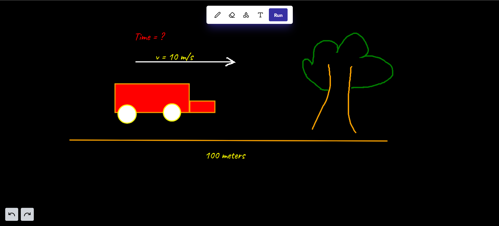
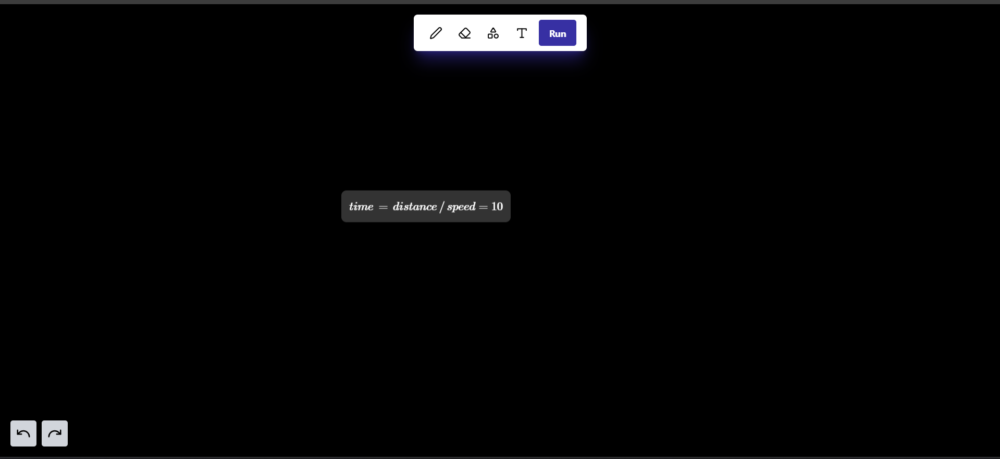

# QuickScribe: Interactive Mathematical Whiteboard



# OUTPUT -



MathScribe is an innovative web application that brings the power of a smart calculator to your digital canvas. Draw, write, or sketch your mathematical problems, and let MathScribe interpret and solve them for you!

## 🌟 Features

- ✏️ **Freehand Drawing**: Write or draw your mathematical expressions naturally.
- 🔢 **Intelligent Recognition**: Powered by Google Gemini AI to interpret your handwritten input.
- 🧮 **Real-time Calculation**: Get instant results for your mathematical problems.
- 🎨 **Shape Tools**: Easily add geometric shapes to your expressions.
- 📝 **Text Input**: Type complex equations with customizable font styles.
- ↩️ **Undo/Redo**: Mistake-proof your work with easy reversibility.
- 🖼️ **Draggable Results**: Flexibly position your calculated results on the canvas.

## 🚀 Getting Started

### Prerequisites

- Node.js (v14 or later)
- npm or yarn

### Installation

1. Clone the repository:
   ```
   git clone https://github.com/ArjunAmbavane01/QuickScribe.git 
   ```

2. Navigate to the project directory:
   ```
   cd QuickScribe
   ```

3. Install dependencies:
   ```
   npm install
   ```

4. Set up environment variables:
   Create a `.env.local` file in the root directory and add:
   ```
   VITE_API_URL=http://localhost:8900
   ```

5. Start the development server:
   ```
   npm run dev
   ```

## 💻 Usage

1. Open MathScribe in your web browser.
2. Use the toolbar to select your preferred input method (pen, eraser, shapes, or text).
3. Write or draw your mathematical expression on the canvas.
4. Click the "Run" button to process your input.
5. View the result displayed on the canvas, which you can drag to reposition.

## 🛠️ Technology Stack

- **Frontend**: React with TypeScript
- **Styling**: Tailwind CSS
- **Icons**: Lucide React
- **Math Rendering**: MathJax
- **API Requests**: Axios
- **AI Integration**: Google Gemini API

## 🤝 Contributing

Contributions are welcome! Please feel free to submit a Pull Request.

## 📄 License

This project is licensed under the MIT License - see the [LICENSE](LICENSE) file for details.

---

Made with ❤️ By Arjun Ambavane